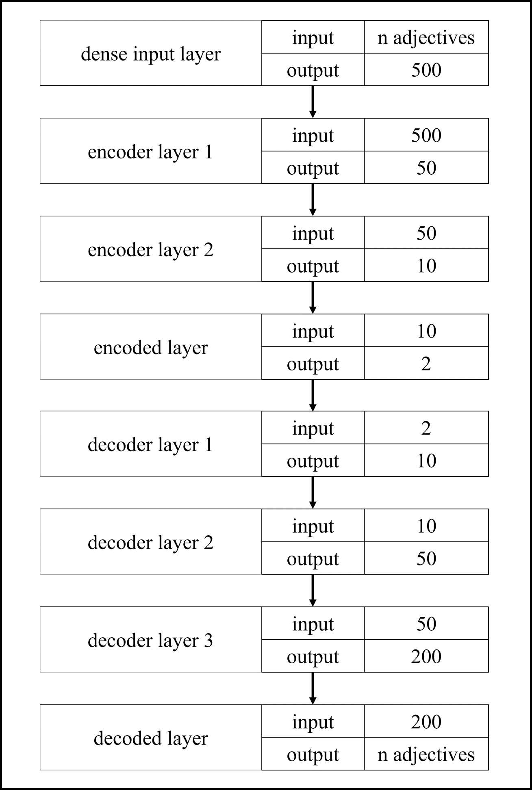
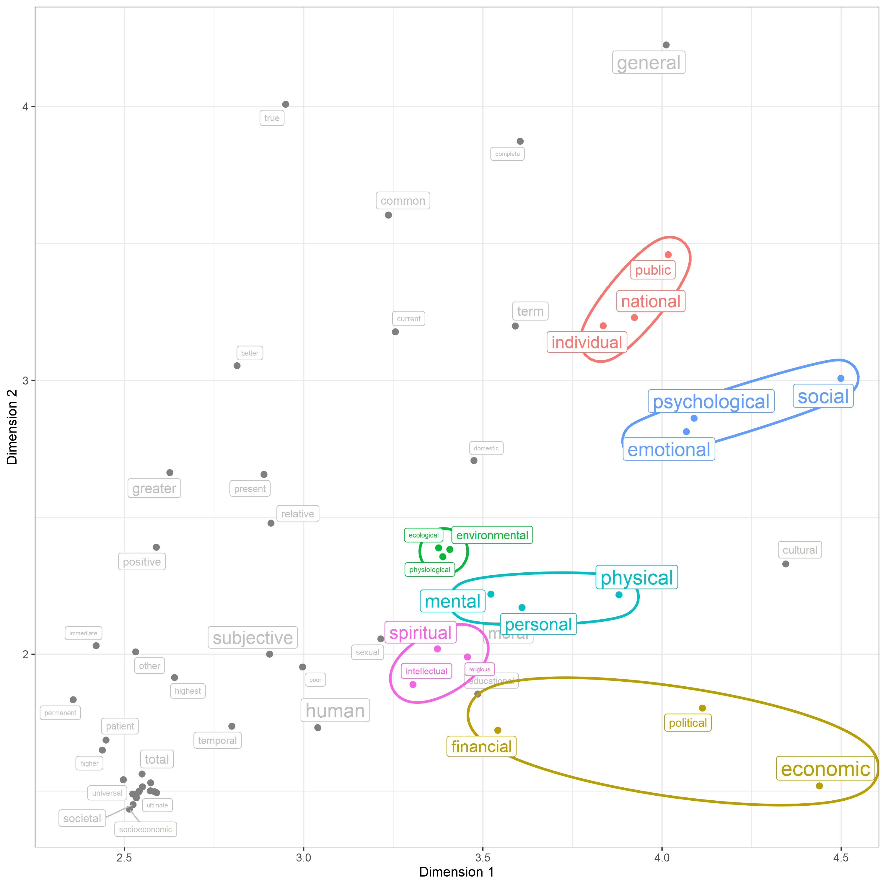

# Clustering Wellbeing Types by AI

## Aim
Wellbeing is not a universially defined construct. The lines between wellbeing, contentment, pleasure and other types of positive emotions are blurred and not well understood (McKenzie, 2015). 
One thing however is clear. Sources of Wellbeing differ from person to person. To emphasize this phenomenon, literature data from the past 200 years are analyzed to visualize interpersonal differences.

## Method
### Data
Literature data from the pst two centuries was retrieved from the [Google NGram Corpus](https://storage.googleapis.com/books/ngrams/books/datasetsv3.html) (Michel et al., 2011). We used the most recent dataset (v3, subset English non-fiction).

#### Data collection
In a first step, the top 1000 adjectives for the word <i>wellbeing</i> were extracted. In turn, description of these top 1000 adjectives were extracted from the corpus. The goal was to analyze which kind of wellbeings were described.  
This resulted in a dataset containing 1000 adjectives used to describe wellbeing and the number of times they were described by different adjectives

### Analysis
This data was fed into an autoencoder (Wang, 2014) aiming to reduce dimensionality to enable clustering. 
Data dimensionality was reduced to two dimensions (<i>encoded layer</i>). The model structure is provided in Figure 1. The model was fit on the full dataset (train-test-split; no validation data), as a best posisble explanation for data structure was the goal, not a generalizable model.

#### Figure 1

After the model was fit, values for the two dimensinons were extracted for every selected adjective describing wellbeing.

## Results

Visual inspection clearly shows, that multiple <i>wellbeing-cluster</i> exist.
<ul>
    <li>Wellbeing depending on identification with the individual or the group</li>
    <li>Wellbeing depending socio-emotional state</li>
    <li>Wellbeing depending on biological factors</li>
    <li>Wellbeing depending on personal development</li>
    <li>Wellbeing depending on spritual and cognitive aspects</li>
    <li>Wellbeing depending on financial aspects</li>
</ul>

## Discussion
As expected, wellbeing can depend on many different aspects of human experience. This makes it all the more important to discern, what influences ones own wellbeing.  
One approach is monitoring and loggin ones behavior and tracking, what results in wellbeing and what does not.  
A helpful tool is the folling app: 
[Github](https://github.com/Classiks/wellbeing-app) 
[Website](https://wellbeing-d402b.web.app/#/) 

## Literature
&emsp;McKenzie, J. (2015). Happiness Vs Contentment? A Case for a Sociology of the Good Life. In <i>Journal for the Theory of Social Behaviour</i> (Vol. 46, Issue 3, pp. 252–267). Wiley. https://doi.org/10.1111/jtsb.12098  
&emsp;Michel, J.-B., Shen, Y. K., Aiden, A. P., Veres, A., Gray, M. K., Pickett, J. P., ... Aiden, E. L. (2011). Quantitative analysis of culture using millions of digitized books. <i>Science, 331</i>(6014), 176–182.  
&emsp;Wang, W., Huang, Y., Wang, Y., & Wang, L. (2014). Generalized Autoencoder: A Neural Network Framework for Dimensionality Reduction. <i>2014 IEEE Conference on Computer Vision and Pattern Recognition Workshops</i>. https://doi.org/10.1109/cvprw.2014.79